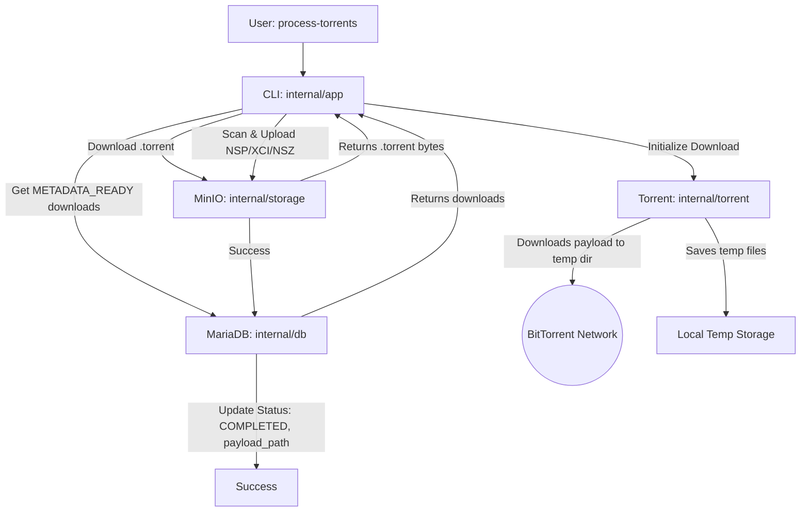

# Architecture Document: Telegram Tinfoil Downloader (Milestone 2)

This document defines the technical foundations and design patterns for the implementation of **Milestone 2**. The focus is on handling the download of torrent payloads using an embedded Go torrent client.

---

## 1. TECHNICAL STACK (M2)

- **Language:** Go 1.26.3
- **Containerization:** Docker & Docker Compose
- **Telegram Integration:** `github.com/gotd/td` (MTProto)
- **Database:** MariaDB 10.11+
- **ORM:** `gorm.io/gorm` + `gorm.io/driver/mysql`
- **Object Storage:** `github.com/minio/minio-go/v7`
- **Torrent Downloader:** `github.com/anacrolix/torrent`
- **Configuration:** `gopkg.in/yaml.v3`
- **Logs:** `go.uber.org/zap` (Structured)

---

## 2. FILE STRUCTURE (Blueprint)

We follow the **Go Project Layout** pattern with a clear separation of concerns:

```text
.
├── cmd/
│   └── downloader/          # CLI Entry point (main.go with search & process-torrents commands)
├── internal/
│   ├── app/                 # Orchestration of search/selection and torrent processing flows
│   ├── torrent/             # Torrent client download service
│   ├── telegram/            # Wrapper around gotd (auth and messaging)
│   ├── storage/             # MinIO storage implementation (upload and download)
│   ├── db/                  # MariaDB models and repositories
│   └── config/              # config.yaml loader
├── pkg/
│   └── switchutil/          # Utilities for parsing game names
├── docs/
│   ├── milestones/          # Details of project phases
│   ├── spec.md              # Formal specification
│   └── architecture.md      # This document
├── Dockerfile               # Docker configuration for application image
├── docker-compose.yml       # Orchestrates local MariaDB, MinIO, and app services
├── config.docker.yaml       # Configuration file for running in Docker
├── go.mod
└── config.yaml.example
```

---

## 3. DATA MODELING (MariaDB)

### Table: `downloads`
Tracks the file lifecycle, from metadata to the final downloaded payload.

| Field | Type | Description |
|:---|:---|:---|
| `id` | `uint` (PK) | Auto-increment ID. |
| `title_name` | `string` | Game name extracted from the search. |
| `telegram_msg_id`| `int` | Telegram message ID for future reference. |
| `telegram_file_id`| `string` | Unique Telegram file ID (or checksum) for validation. |
| `storage_path` | `string` | Path of the `.torrent` object in MinIO (e.g., `torrents/mario.torrent`). |
| `payload_path` | `string` (TEXT) | Path(s) of the final extracted game payloads (NSP/XCI/NSZ) in MinIO. |
| `status` | `string` | Invariant: `PENDING`, `METADATA_READY`, `DOWNLOADING`, `COMPLETED`, `FAILED`. |
| `size_bytes` | `int64` | Captured file size. |
| `created_at` | `datetime` | Creation timestamp. |
| `updated_at` | `datetime` | Update timestamp. |

---

## 4. FLOW DIAGRAMS

### Capture Flow (Milestone 1)
```mermaid
graph TD
    A[User: search "Game"] --> B[CLI: internal/app]
    B --> C[Telegram: internal/telegram]
    C -- "Sends msg to Search Bot" --> D((Telegram Cloud))
    D -- "Receives Response" --> C
    C --> B
    B -- "Displays Numbered List" --> E[User: Selects ID]
    E --> F[CLI: Requests File]
    F --> G[MinIO: internal/storage]
    G -- "Upload Success" --> H[MariaDB: internal/db]
    H --> I[CLI: Final Success]
```

### Processing Flow (Milestone 2)


---

## 5. CODE GUIDELINES (Constitution)

1. **Explicit Errors:** Never ignore errors (`_`). Always use structured logging and return them.
2. **Interface Isolation:** The `storage` component must be injected via an interface to allow unit testing without a real MinIO instance.
3. **Context Awareness:** All I/O functions (DB, MinIO, Telegram) must accept `context.Context`.
4. **No Global State:** Avoid global variables for database connections or clients. Use Dependency Injection in `main.go`.
5. **Config First:** The program must fail immediately if mandatory credentials in `config.yaml` are missing or invalid.
6. **Graceful Shutdown:** The CLI must handle `SIGINT/SIGTERM` to close the Telegram session, database connections, and torrent client cleanly, deleting any partially downloaded files.
7. **Clean temp directory:** All local downloads must be cleaned up on success or failure, to avoid leaking disk space.

